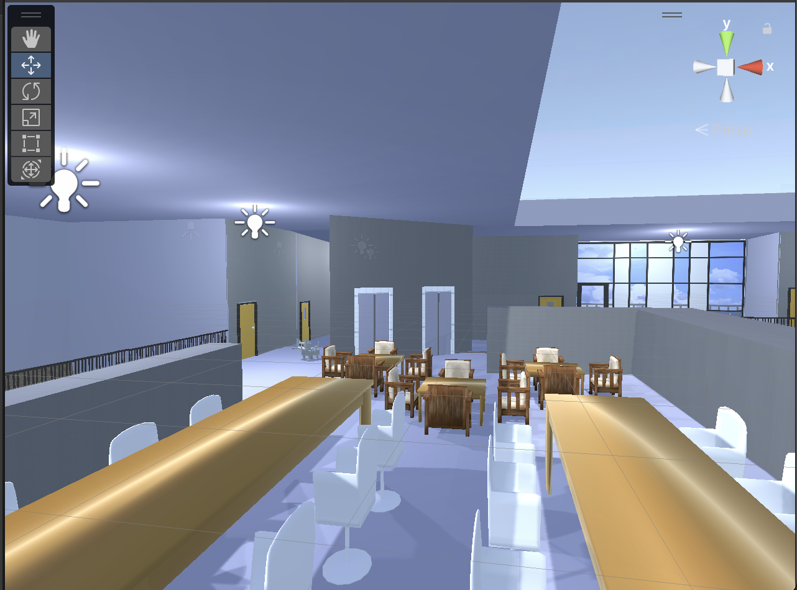

# unity
국제교류관 4층을 유니티로 표현해서 게임을 만들었습니다.  

### <게임 진행 방법> 

1. Start 버튼을 눌러 게임 시작 

2. NPC가 주는 퀘스트를 보고 인공지능소프트웨어학과와 관련된 실을 찾아감 

3. 잘못된 실에 들어가면 처음부터 재시작됨 

4. 마지막 실에 들어가면 NPC가 게임 클리어를 알리고 Retry 버튼이 등장함  

게임 패키지에 관심 있으시면, 20221052@hanbat.ac.kr 로 연락주세요. 
패키지 파일을 보내드리겠습니다.
